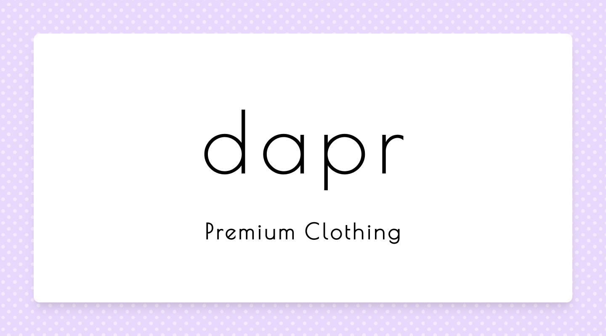

<h1 align="center">
<br>
  
<br>
<br>
DAPR | Online Apparel Store
</h1>

<p align="center">
Application created for the purpose of study, an ecommerce store
</p>

<p align="center">
  <a href="https://opensource.org/licenses/MIT">
    
  </a>
  
  <a href='https://dapr.vercel.app'>
    
  </a>

</p>

<!-- <div align="center">


</div> -->

<hr />

## Built With

-   ⚛️ **React** — A JavaScript library for building user interfaces
-   🔼 **Next.js** - Framework for building production-ready React applications
-   ♻ **React Hooks** — Used useReducer & Context API for state management
-   🌸 **TailwindCSS** - A utility-first CSS framework that can be used to build modern websites
-   💹 **Fake Store API** — Fake rest api to fetch mock data
-   💖 **Misc** — ESlint/Prettier/Editor Config

## Getting started

1. Clone this repo using `git clone https://github.com/ashwinkhode/dapr.git`
2. Move yourself to the appropriate directory: `cd dapr`<br />
3. Run `yarn` to install dependencies<br />
4. Run the development server:

```bash
npm run dev
# or
yarn dev
```

Open [http://localhost:3000](http://localhost:3000) with your browser to see the result.

## Still Under Development

-   [x] Wishlist Page
-   [x] Cart Page
-   [x] Product Page
-   [x] Create ui elements -> buttons, cards, nav, modal and footer, layout
-   [] setup axios
-   [] create landing page
-   [] Polish UI
-   [] Sort & Filter Component

## License

This project is licensed under the MIT License - see the [LICENSE](https://opensource.org/licenses/MIT) page for details.

## Author

Ashwin Khode - [Twitter](https://www.twitter.com/ashwin4real) - [Linkedin](https://www.linkedin.com/in/ashwin-khode/)
